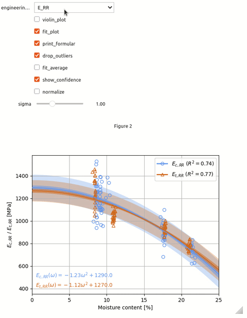

# Wood Rheology

This repository allows for the exploration of rheological data of wood. It is linked to the research work **J. M. and Wittel, K. M. (2026). From Elasticity to Creep: Orthotropic moisture-dependent Rheology of Norway Spruce. *Submitted to Holzforschung/Wood Research and Technology*.** Please cite this research publication when using data from this repository.

## Content

The data of this repository comprises:
- **Species:** Norway spruce
- **Properties:** elasticity, strength, plasticity, viscoelasticity, hygroexpansion, sorption, density
- **Data format:** experimental data points in tables (in folder *data*), exploration of fitting data via widgets (in jupyter notebooks)

To explore the data, select any of the notebooks in Jupyter Lab and select "Restart Kernel and Run All". This creates the Jupyter widgets that allow for interactive exploration of the data.

The widgets are designed in the following fashion.

This repository will be updated in the future with mechanosorptive data.

## Installation

Create a Python 3.10.14 environment and install the packages in `requirements.txt`. Example for Linux and Anaconda:
- Create environment: `conda create --name wood-rheology python=3.10.14`
- Enter python environment: `conda activate wood-rheology`
- Navigate to the repository and install packages: `pip3 install -r requirements.txt`
- Launch Jupyter Lab: `jupyter lab`

## Usage
Each notebook is designed that the widgets can be used by running the complete notebook via **"Restart Kernel and Run All"**. The experimental data points can be extracted from the tables in the folder *data*. For doing so, each widget has an "export" button that exports the data points of the current selection as CSV table.

## Authors and acknowledgment
**Authors:** J. M. Maas (ORCID: ORCID: 0000-0001-5679-7352), F. K. Wittel (ORCID: 0000-0001-8672-5464)

**Please cite the following paper when using data from this repository:** Maas, J. M. and Wittel, K. M. (2026). From Elasticity to Creep: Orthotropic moisture-dependent Rheology of Norway Spruce. *Submitted to Holzforschung/Wood Research and Technology*.

## License
All programming code/scripts that are part of this data set are licensed under the MIT License <https://opensource.org/license/MIT>.

All research data that accompanies the programming code/scripts are licensed under the Creative Commons license CCBY 4.0 <https://creativecommons.org/licenses/by/4.0/deed.en>.
