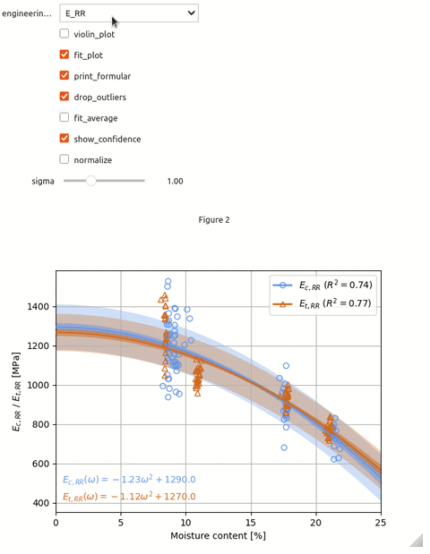

# Wood Rheology

This repository enables exploration of rheological data on wood. It is based on the research work of **Maas, J. M. and Wittel, F. K. (in press). From Elasticity to Creep: Orthotropic moisture-dependent Rheology of Norway Spruce. *Holzforschung/Wood Research and Technology*.** Please cite this research publication when using data from this repository.

## Description

The data of this repository comprises:

- **Species:** Norway spruce
- **Properties:** elasticity, strength, plasticity, viscoelasticity, hygroexpansion, sorption, density
- **Anatomical directions:** compression/tension R, T, L; shear RT, TR, RL, LR, TL, LT
- **Data format:** experimental data points in tables (in folder *data*), exploration of fitting data via widgets (in Jupyter notebooks)

All data originate from samples of the same tree, i.e., they are consistent with one another.

To explore the data, open any notebook in Jupyter Lab and select "Restart Kernel and Run All". This creates Jupyter widgets that enable interactive exploration of the data.

The widgets are designed as follows.

This repository will be updated in the future with mechanosorptive data.

## Content

This repository contains the following folders and files.

**Folders:**

- *data*: Raw data required for the notebooks to run.
- *figures*: Figures used in the Markdown explanations of the notebooks and figures created by some of the notebooks.
- *utils*: Helper functions used by the notebooks.

**Notebooks:**

- *01_elasticity.ipynb*: Allows for visualization and export of fits and experimental data points for the elastic stiffnesses.
- *02_strength.ipynb*: Allows for visualization and export of fits and experimental data points for the strength parameters.
- *03_plasticity.ipynb*: Allows for visualization and export of fits and experimental data points for the plastic deformations.
- *04_viscoelasticity.ipynb*: Allows for visualization and export of fits and experimental data points for the viscoelasticity parameters, i.e., Kelvin-Voigt coefficients and fits of the time-moisture superposition principle.
- *05_sorption.ipynb*: Visualizes the density distribution, hygroexpansion, and sorption isotherm of the tree from which the samples are obtained.

## Installation

Create a Python 3.10.14 environment and install the packages in `requirements.txt`. Example for Linux and Anaconda:

- Create environment: `conda create --name wood-rheology python=3.10.14`
- Enter Python environment: `conda activate wood-rheology`
- Navigate to the repository and install packages: `pip3 install -r requirements.txt`
- Launch Jupyter Lab: `jupyter lab`

Alternatively, this repository can be run directly via RenkuLab at <https://renkulab.io/p/jomaas/interactive-exploration-of-wood-rheology>.

## Usage

Each notebook is designed so that the widgets can be used by running the complete notebook via **"Restart Kernel and Run All"**. The experimental data points can be extracted from the tables in the folder *data*. For doing so, each widget has an "export" button that exports the data points of the current selection as a CSV table.

## Authors and acknowledgment

**Authors:** J. M. Maas (ORCID: 0000-0001-5679-7352), F. K. Wittel (ORCID: 0000-0001-8672-5464)

**Please cite the following paper when using data from this repository:** Maas, J. M. and Wittel, F. K. (in press). From Elasticity to Creep: Orthotropic moisture-dependent Rheology of Norway Spruce. *Holzforschung*.

## License

All programming code/scripts that are part of this data set are licensed under the MIT License <https://opensource.org/license/MIT>.

All research data that accompanies the programming code/scripts are licensed under the Creative Commons license CC BY 4.0 <https://creativecommons.org/licenses/by/4.0/deed.en>.
